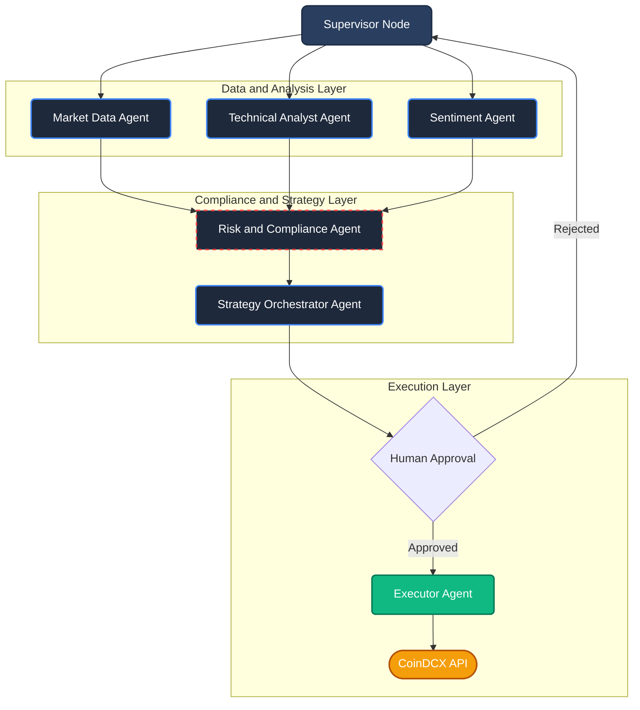

# AgenticTrader

An autonomous, multi-agent trading system engineered for the Indian crypto market using LangGraph, Google Gemini, and the CoinDCX API. This project serves as a comprehensive demonstration of applied AI in financial technology, showcasing complex state management, tool usage, and human-in-the-loop compliance checks.

[](https://www.python.org/downloads/)
[](https://github.com/langchain-ai/langgraph)
[](https://streamlit.io)

---

## Engineering Overview

AgenticTrader is designed to solve the complexity of continuous market monitoring and regulatory compliance. Rather than relying on a monolithic LLM call, the system utilizes a supervisor architecture orchestrating six specialized, tool-equipped sub-agents. 

### Key Technical Achievements

- **Agentic State Management**: Utilizes LangGraph to handle recursive reasoning, reflection loops, and persistent state across trading cycles.
- **Real-Time Data Pipelines**: Integrates CoinDCX REST and WebSocket APIs to ingest live order books and candlestick data.
- **Retrieval-Augmented Generation (RAG)**: Employs local vector databases to query Indian FIU-IND regulations and PMLA guidelines dynamically.
- **Automated Compliance Engine**: Programmatically enforces Indian tax laws (30% flat tax, 1% TDS) and halts non-compliant trades before execution.
- **Human-in-the-Loop Execution**: Features a robust paper-trading simulation engine with an option for live execution pending user authorization.

---

## Baseline Backtest Performance

The current configuration runs an ultra-conservative, capital-preservation strategy. Historical simulation for the BTC/INR pair yielded the following baseline metrics:

- **Buy-and-Hold Return**: +7.5%
- **Maximum Drawdown**: 0.6%

*Analysis: The extreme compression of Maximum Drawdown (limited to just 0.6%) demonstrates the Risk Agent's strict enforcement of capital preservation. Future iterations will tune the Technical Analyst agent to take more aggressive positions during confirmed uptrends.*

---

## Multi-Agent Architecture

The system routes tasks through a central Supervisor, utilizing isolated contexts for specialized reasoning.



### Agent Roles

1. **Market Data**: Fetches and structures live CoinDCX exchange data.
2. **Technical Analyst**: Processes multi-timeframe indicators (RSI, MACD, Bollinger Bands, ATR) via pandas-ta.
3. **Sentiment Researcher**: Analyzes India-specific financial news and global Fear and Greed indices.
4. **Risk & Compliance**: Queries local regulatory RAG databases to size positions and enforce tax limits.
5. **Strategy Orchestrator**: Synthesizes structured data and LLM reasoning into a final, actionable trade decision.
6. **Executor**: Handles API interfacing for order placement and logs transaction results to a local database.

---

## Quick Start Guide

### 1. Installation

Clone the repository and initialize the Python virtual environment:

```bash
git clone https://github.com/yourusername/DCX-AgenticTrader.git
cd DCX-AgenticTrader
python -m venv venv
source venv/bin/activate  # On Windows use: venv\Scripts\activate
pip install -r requirements.txt
```

### 2. Configuration

Copy the example environment file located in the root directory:

```bash
cp .env.example .env
```

Edit `.env` to include your credentials:
- `COINDCX_API_KEY` and `COINDCX_API_SECRET`
- `GOOGLE_API_KEY` (Required for Gemini reasoning)

### 3. Execution (Trading Modes)

The system defaults to **Paper Trading** (simulated) for safety. To switch to **Live Trading** with real funds, append the `--live` flag. The command-line interface provides multiple operation modes:

```bash
# Run a single evaluation cycle in paper-trading mode
python main.py run --once

# Start the continuous autonomous trading loop (Paper Mode)
python main.py run

# Start the continuous autonomous trading loop (LIVE Mode - REAL FUNDS)
python main.py run --live

# Launch the interactive Streamlit monitoring dashboard
python main.py dashboard

# Generate an interactive backtest report
python main.py backtest --pair BTCINR --months 6
```

---

## Technology Stack

- **Orchestration**: LangGraph, LangChain
- **Intelligence**: Google Gemini Flash 2.0
- **Data & Computation**: pandas, pandas-ta
- **Persistence**: ChromaDB (Vector Storage), SQLite (Trade Ledgers)
- **Visualization**: Streamlit, Plotly
- **Exchange Integration**: CoinDCX APIs

---

## Disclaimer

**CRITICAL WARNING:** This software is provided for educational, research, and portfolio demonstration purposes only. It does not constitute financial advice.

- **No Sandbox Environment**: CoinDCX does not provide a testnet. Live API keys will execute trades with real funds.
- **Use Paper Trading**: Always test configurations using the default paper trading mode.
- **Tax Obligations**: Consult a qualified professional regarding Indian crypto tax regulations.
- **Risk of Loss**: Cryptocurrency trading involves significant financial risk. Use at your own risk.

---

## License

MIT License — see the LICENSE file for details.
